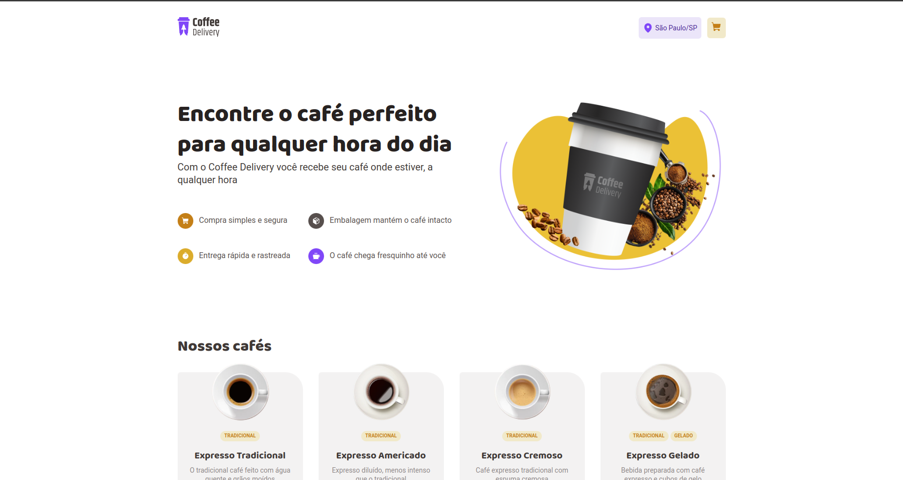
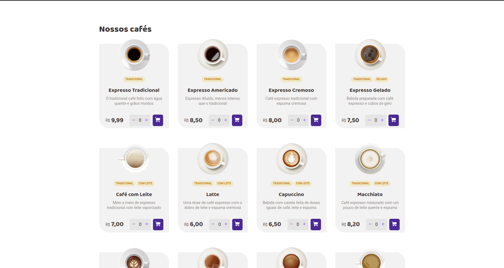
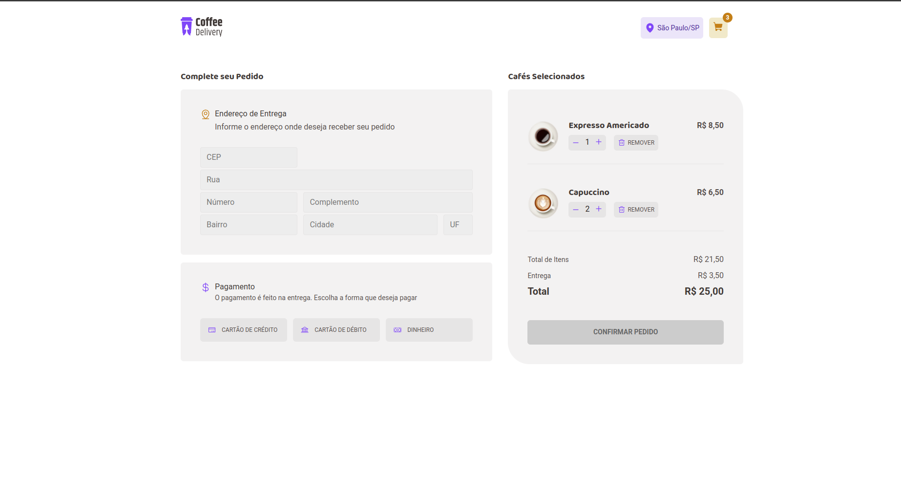
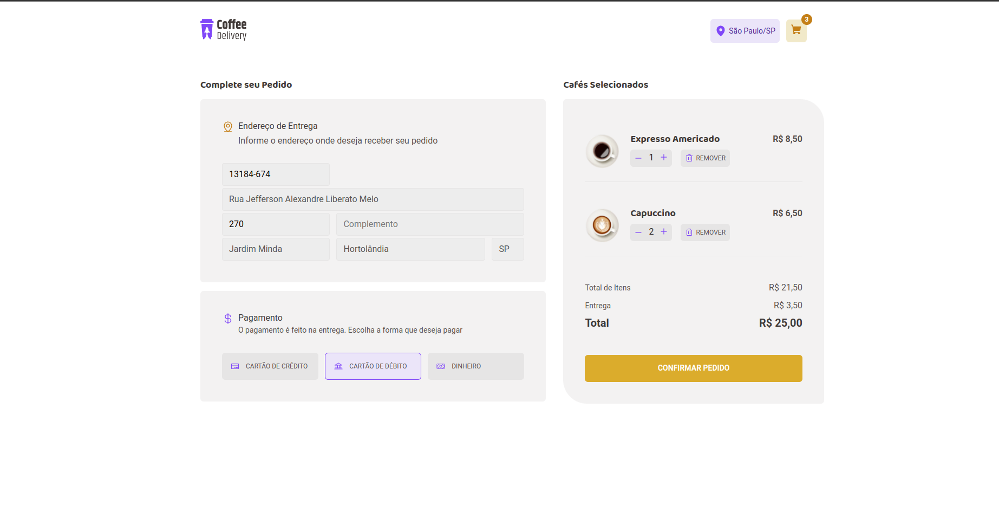
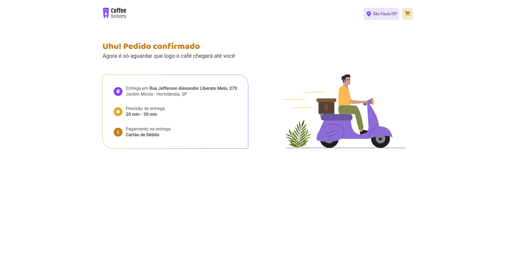

<h4 align="center"> 
	:coffee: Coffee Delivery 1.0 :coffee:
</h4>

[](https://github.com/edgardfn/cofee_delivery/blob/main/LICENSE) 

## 💻 Sobre o projeto

Coffee Delivery :coffee: - é um sistema de cafeteria, com listagem de cafés para compras, podendo selecionar várias unidades de um único café, tem sesssão de carrinho de compras com endereço de entrega que faz a busca automática pelo cep usando a api [ViaCEP], com opção também de escolher a forma de pagamento e listagem dos cafés selecionados podendo alterar a quantidade e excluir todos de um café específico, mostrando também o valor total do pedido e ao finalizar é levado a página com dados como endereço de entrega selecionado e forma de pagamento.

Projeto desenvolvido no curso da trilha Ignite da Rocketseat.

## 🎨 Layout

O layout da aplicação está disponível no Figma:

<a href="https://www.figma.com/file/5yT9ZzZmRQRS4yivGGB3pl/Coffee-Delivery/duplicate">
  
</a>

### Prints Web


  

  
  
  
  
  
  
  


## 🛠 Tecnologias

- [ReactJS]
- [Typescript]
- [React Router DOM]
- [Styled Components]
- [Context API]
- [Redux]
- [Effect Hook]
- [Axios]
- [Phosphor Icons]
- [React Input Mask]
- [UUID]

## 🚀 Como executar o projeto

### Pré-requisitos

Antes de começar, você vai precisar ter instalado em sua máquina as seguintes ferramentas:
[Git](https://git-scm.com), [Node.js][nodejs]. 
Além disto é bom ter um editor para trabalhar com o código como [VSCode][vscode]

```bash
# Clone este repositório
$ git clone https://github.com/edgardfn/cofee_delivery.git

# Acesse a pasta raiz do projeto no seu terminal/cmd
$ cd cofee_delivery

# Instale as dependências
$ npm install

# Execute a aplicação em modo de desenvolvimento
$ npm run start

# A aplicação será aberta na porta:3000 - acesse http://localhost:3000
```

## 📝 Licença

Este projeto esta sobe a licença MIT.

Feito com ❤️ por Edgard Finotti Neto 👋🏽 [Entre em contato!](https://www.linkedin.com/in/edgard-finotti-neto-a258b21a2/)

[nodejs]: https://nodejs.org/
[Typescript]: https://www.typescriptlang.org/
[expo]: https://expo.io/
[ReactJS]: https://reactjs.org
[rn]: https://facebook.github.io/react-native/
[yarn]: https://yarnpkg.com/
[vscode]: https://code.visualstudio.com/
[vceditconfig]: https://marketplace.visualstudio.com/items?itemName=EditorConfig.EditorConfig
[license]: https://opensource.org/licenses/MIT
[vceslint]: https://marketplace.visualstudio.com/items?itemName=dbaeumer.vscode-eslint
[prettier]: https://marketplace.visualstudio.com/items?itemName=esbenp.prettier-vscode
[Rocketseat]: https://rocketseat.com.br
[Styled Components]: https://styled-components.com/
[React Router DOM]:https://github.com/remix-run/react-router
[React Hook Form]:https://github.com/react-hook-form/react-hook-form
[Validação de Formulários com Biblioteca Zod]:https://github.com/colinhacks/zod
[ViaCEP]:https://viacep.com.br/
[Axios]: https://github.com/axios/axios
[Phosphor Icons]: https://github.com/phosphor-icons/react
[React Input Mask]: https://github.com/sanniassin/react-input-mask
[UUID]: https://github.com/uuidjs/uuid
[Context API]: https://reactjs.org/docs/context.html
[Redux]: https://react-redux.js.org/
[Effect Hook]: https://reactjs.org/docs/hooks-effect.html
